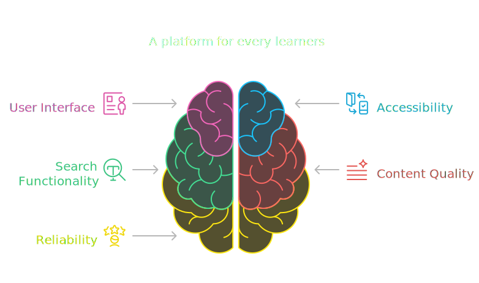
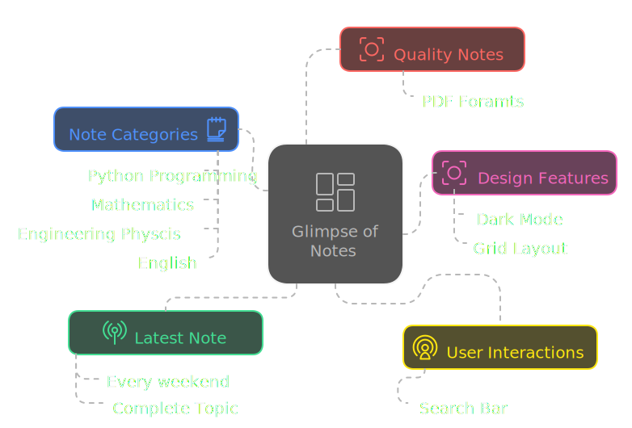
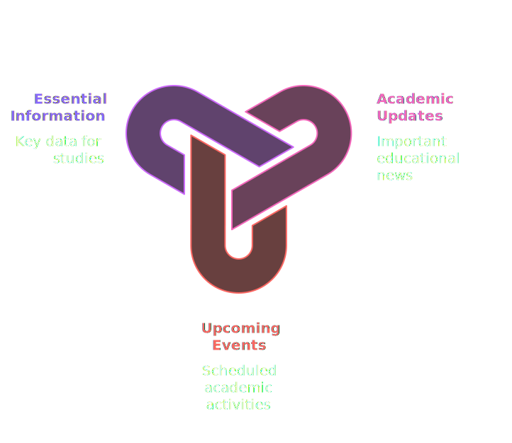
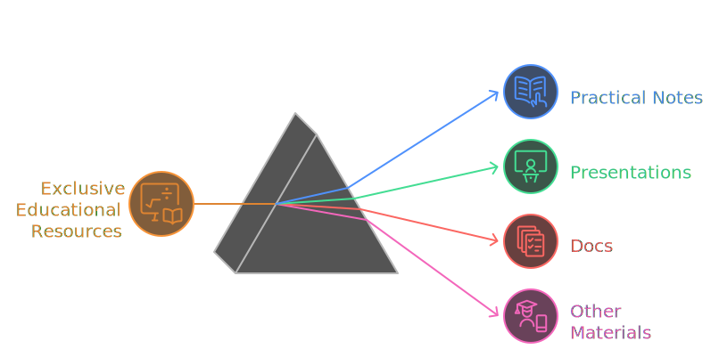

#  NotEase - A modern note-management platform for students.!

Hey, check this out! It's called NotEase, and it's like a super-organized digital notebook just for students. You know how you have notes scattered everywhere? This keeps them all in one place!

## Cool Features:

- **All Your Notes, Sorted!**
  
  - See? You can organize your notes by subject, so you'll never lose that important math formula or history fact again. It's like having a perfectly organized notebook, but on your computer!
- **Stay in the Loop with Announcements!**
  
  - No more missing important school announcements! NotEase shows you all the latest updates, like changes to the schedule or reminders about upcoming tests. It's like a school bulletin board right on your screen!
- **Unlock Awesome Extras!**
  
  - Want even cooler features? NotEase has exclusive perks you can get for a small price. Think of it like getting extra power-ups for your studies! Maybe it's extra storage, or special tools to help you study. It's like a little upgrade for your school life.
- **And So Much More!**
  - There's tons of other stuff too, like... (You could add more features here as you develop them!)

## How It Works (Tech Talk, Simplified):

- It's built with some really cool computer stuff called 'Next.js' and 'TypeScript'. Think of it like using the best building blocks to make a super strong and reliable app. And 'Clerk' helps keep everything safe and secure, like a digital lock on your stuff.

## Why It's Great:

- **Easy to Use:** It's super simple to find your notes and see important stuff. No complicated menus or buttons.
- **Keeps You Organized:** Say goodbye to messy notebooks and hello to organized notes!
- **Helps You Stay Informed:** Never miss an announcement again!

## Contributors

